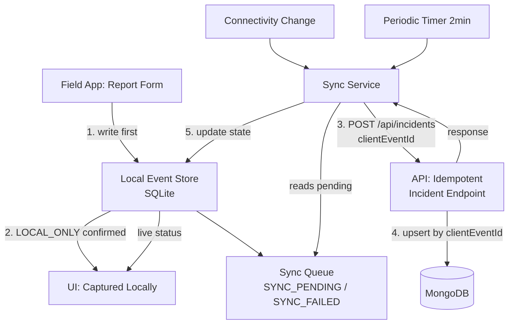

# OFFLINE_ARCHITECTURE.md — Store-and-Forward Field Intelligence (Phase 5)

## Audit summary (Phase 5A)

**Already reusable, unchanged:**
- `location_service.dart` (Phase 4A) — LIVE GPS / NER DEMO modes, full `GpsFix` metadata, no silent fallback. Reused as-is.
- `api_service.dart`'s `getNearestRoad()` — reused for an online, best-effort road-match preview in the form.
- Backend `Incident` model, `createIncident` controller, AI pipeline, road association — all reused unchanged except the additive idempotency logic (see below).

**Missing (built in this phase):**
- Any local persistence at all — the app had zero offline capability; a failed network call simply lost the report.
- Connectivity awareness.
- A sync/retry engine.
- An idempotency key on the backend.
- Media queue schema (no photo capture UI exists yet — see Media Handling below).

**Incorrect/incomplete (fixed):**
- The old report flow called `ApiService.reportIncident()` directly and treated any thrown exception as final failure with no local record — offline use was impossible.

**Proposed minimal architecture:** the one implemented below — `sqflite` for local storage, `connectivity_plus` for network signal, a small custom sync engine (no external state-management/sync framework), and a `clientEventId`-based idempotency key on the existing `Incident` model.

## Architecture



## 3. Local storage technology selected

**`sqflite`** — the standard, widely-supported embedded SQLite plugin for Flutter. Chosen over alternatives (Hive, Isar, Drift) because:
- It's a plain relational table with an explicit sync-state column and indexes — no ORM/reactive-query layer needed for this MVP's access patterns (insert, update-by-id, filter-by-status).
- Smallest reliable dependency surface, per the mission's explicit preference.
- SQL is directly auditable (see the `CREATE TABLE` statements in `local_event_store.dart`).

`connectivity_plus` for network signal, `uuid` for device-generated `eventId`s. No other new dependencies.

## 4. Event schema

`lib/models/local_incident_event.dart` / `local_event_store.dart`'s `incident_events` table:

| Field | Notes |
|---|---|
| `eventId` (PK) | UUID v4, generated on-device, stable across every retry |
| `eventType`, `description`, `severity` | driver-supplied |
| `latitude`, `longitude`, `gpsAccuracyMeters`, `speedMetersPerSecond`, `headingDegrees` | from `GpsFix` (Phase 4A) — null when the platform didn't report it, never fabricated |
| `locationMode` | `LIVE_GPS` \| `NER_DEMO` |
| `roadId`, `roadMatchConfidence` | populated once resolved (server-side, on sync — not computed offline) |
| `mediaReferences` | pipe-delimited local file paths — see Media Handling |
| `syncStatus`, `retryCount`, `lastSyncAttempt`, `lastSyncError`, `serverIncidentId` | sync bookkeeping |
| `source` | always `FIELD_APP` |

Indexed on `syncStatus` and `createdAt` (what the sync engine and any future "my reports" list actually query by). Schema versioned (`_dbVersion = 1`) with an `onUpgrade` migration hook already wired, even though there's nothing to migrate yet.

## 5. Sync state machine

```
LOCAL_ONLY -> SYNC_PENDING -> SYNCING -> SYNCED
                   ^              |
                   +--- SYNC_FAILED
```

No ambiguous `isSynced` boolean anywhere — `SyncStatus` is a 5-value enum, and both the local store and the UI branch on all five states explicitly.

- **LOCAL_ONLY**: written to SQLite, sync not yet attempted. This state alone is what makes "Report Captured" true — before this, nothing is shown to the user.
- **SYNC_PENDING**: queued (set immediately after LOCAL_ONLY, since the app always attempts to queue for sync right away).
- **SYNCING**: an upload attempt is in flight.
- **SYNCED**: the server confirmed persistence (fresh create OR idempotent replay) — `serverIncidentId` is set.
- **SYNC_FAILED**: an attempt failed. Retained locally, eligible for retry until `retryCount` reaches the cap (8) — never deleted, never silently dropped.

## 6. Idempotency implementation

**Client**: `eventId` (UUID v4) generated once at capture time, sent as `clientEventId` on every sync attempt for that event — including retries after a timeout, app restarts mid-sync, or duplicate sync passes triggered by both a connectivity event and the periodic timer.

**Server** (`Incident.js` + `incidentController.js`):
- `clientEventId` field, with a **partial unique index** (`partialFilterExpression: { clientEventId: { $type: 'string' } }`) — enforces uniqueness only when present, so the many existing incidents with no `clientEventId` (SIMULATION/AUTHORITY-sourced, pre-Phase-5 DRIVER_APP reports) remain valid without any backfill.
- `createIncident` checks for an existing document by `clientEventId` **before** creating — if found, returns it directly (`idempotentReplay: true`) without re-running AI analysis or road association.
- **Race condition handled**: two concurrent requests with the same `clientEventId` can both pass the pre-check before either finishes writing. The database's unique index rejects the second `Incident.create()` with a MongoDB `E11000` duplicate-key error; this is caught specifically and handled identically to the idempotent-replay path — never surfaced as a 500 error for what is actually a successfully-recorded event.

Verified with 4 schema-level tests (`test/incidentIdempotency.test.js`) — see Tests below for what could and couldn't be exercised in this sandbox.

## 7. Connectivity behavior

`ConnectivityService` reports `online` / `offline` / `unknown` from `connectivity_plus`. This is explicitly **network reachability only** — a device can report WiFi/mobile connectivity while the actual API is unreachable (wrong IP, server down, firewalled). The sync engine never treats "online" as "will succeed" — it always attempts the real HTTP request and handles that request's own failure via `ApiErrorType` (`network` / `timeout` / `serverError` / `validation` / `unknown`), independent of what the connectivity signal said going in.

## 8. Media behavior

**The current report flow has no photo-capture UI at all** (confirmed in the Phase 5A audit — no `image_picker` or camera dependency exists, and it was explicitly optional and unimplemented back in the original screening-demo scope). Per the mission's conditional instruction ("if the current report flow supports photographs..."), full media capture was **not** built this phase.

What **was** built, honestly, ready for when capture UI exists: a `media_queue` SQLite table (`mediaId`, `eventId`, `localPath`, `syncStatus`, `retryCount`, foreign-keyed to `incident_events`) — schema only, currently unused, never populated with placeholder rows. No fake upload success is possible because no upload path exists yet. Implementing capture (`image_picker`) and the actual upload endpoint (which doesn't exist on the backend either) is flagged as a Phase 5 follow-up, not silently faked.

## 9. Offline GPS behavior

Unchanged from Phase 4A, explicitly preserved per this phase's constraints: LIVE GPS never silently falls back to demo data on failure (`LocationException` surfaces the real error), and NER DEMO remains an explicit, separately-labeled choice. When offline, GPS acquisition itself is unaffected (`geolocator` doesn't need network) — the report is captured locally with real coordinates/accuracy/speed/heading exactly as available, and the offline-vs-online distinction only affects whether the *sync* (and the best-effort road-match *preview*) happens immediately or later.

## 10. Offline map behavior

**Not implemented this phase, and not faked.** Per the mission's explicit instruction to implement "the smallest defensible MVP" or document it as a follow-up rather than fake it: this app has no map view in the report flow at all currently (the driver app was never given a map screen in any prior phase — only the web dashboard has one). Adding an offline-capable map is therefore a net-new feature, not a modification of an existing one, and is deferred to a dedicated follow-up rather than bolted on incompletely here.

## 11. API changes

`POST /api/incidents` gains an optional `clientEventId` field in the request body. Fully backward compatible — omitting it behaves exactly as before. Response gains an optional `idempotentReplay: true` flag when the request was recognized as a retry of an already-processed event.

## Failure recovery

- **App killed mid-capture** (before the local SQLite write completes): the report was never "captured" — nothing to recover, and the UI never claimed otherwise, since "Report Captured" is only shown after the local write succeeds.
- **App killed after local capture, before sync**: the event sits in SQLite as `SYNC_PENDING`. `SyncService.start()` runs an immediate pass on next launch specifically to catch this.
- **Sync request sent, response lost** (e.g. app killed mid-request, or a network drop after the server processed it but before the response arrived): the next retry sends the same `clientEventId` — the server-side idempotency check means this is always safe, never a duplicate `Incident`.

## Data retention

Local events are never deleted automatically by this app in any code path — not on sync success (kept as `SYNCED` with the server ID for the user's own reference), not on repeated failure (kept as `SYNC_FAILED`, retry-eligible until the cap, then simply stops auto-retrying while remaining on-device and visible). `LocalEventStore.deleteForTesting()` exists only for test scaffolding and is never called from app code.

## Security/privacy considerations

- The local SQLite database is stored in the app's private sandboxed storage (standard `getDatabasesPath()`), not externally accessible without device root/debugging access.
- No authentication exists anywhere in this system yet (a pre-existing gap noted in the Phase 0 audit, not introduced or fixed here) — the backend accepts any `POST /api/incidents` request. This means `clientEventId` is an idempotency key, not a security credential; the current API remains as open as it was before this phase.
- GPS coordinates are retained locally until synced (and after, for the user's own reference) — same data the server already stores once synced, so this doesn't introduce a new retention category, just a temporary on-device copy during the offline window.

## Tests

8 new Flutter-side tests (`test/local_incident_event_test.dart`, `test/sync_backoff_test.dart`) covering model round-trip serialization (all fields, all `SyncStatus` values, null-field honesty) and backoff calculation (growth, cap, determinism) — these are pure Dart/plugin-free and will run correctly under `flutter test` once the project has its native scaffolding (`flutter create .`, per `FLUTTER_SETUP.md`).

4 new backend tests (`test/incidentIdempotency.test.js`) verifying the schema-level idempotency contract (field exists, partial unique index configured correctly, documents with and without `clientEventId` both validate).

**Not testable in this sandbox** (no Flutter SDK — the same limitation noted in every prior Flutter-touching phase, and no MongoDB Atlas access — the same limitation noted in every prior backend phase):
- The full local-DB integration (`LocalEventStore`'s actual SQLite reads/writes) — `sqflite` requires platform channels unavailable outside a real device/emulator or `sqflite_common_ffi` desktop test setup, neither present here.
- `SyncService`'s actual network-retry behavior end-to-end.
- The backend's race-condition handling (`E11000` catch path) against a real concurrent MongoDB write.
- The full restart-recovery scenario (create offline -> kill app -> relaunch -> event persists -> sync -> verify no duplicate) — this requires a running device and backend together.

## Known limitations

- No photo capture UI (see Media Handling).
- No offline map (see Offline Map Behavior).
- No authentication (pre-existing, unaffected by this phase).
- Retry cap (8 attempts) stops **automatic** retries but never deletes the event — a manual "retry now" UI action isn't built yet (the event remains queryable and technically retriable by resetting `retryCount`, just not exposed in the UI this phase).
- `connectivity_plus`'s signal is best-effort per its own platform-level accuracy — Android/iOS's own connectivity APIs occasionally report transient false positives/negatives, which is exactly why this design never trusts connectivity status as proof of backend reachability (see Connectivity Behavior above).

## Manual test steps for a real Android device

1. `flutter create .` in `flutter_app/` (see `FLUTTER_SETUP.md`), then `flutter pub get`.
2. Start the backend, confirm `baseUrl` in `api_service.dart` is reachable from the device.
3. Turn on Airplane Mode on the device.
4. Open the app -> Report Incident -> fill the form -> **Capture Report**. Confirm the "Report Captured" screen appears with `SYNC_PENDING` status — never claiming synced.
5. Force-close the app (not just backgrounding) via the OS app switcher.
6. Reopen the app. Confirm the sync attempt runs automatically shortly after launch (still offline — should remain `SYNC_PENDING`/fail gracefully to `SYNC_FAILED`, never crash).
7. Turn off Airplane Mode.
8. Within ~2 minutes (or immediately, since a connectivity-change listener also triggers a pass), confirm the event transitions to `SYNCED` with a real `serverIncidentId`, and that the corresponding incident appears exactly once on the web dashboard's Incident Reports panel.
9. Repeat steps 3-8 a second time with a different report to confirm no cross-contamination between events.
